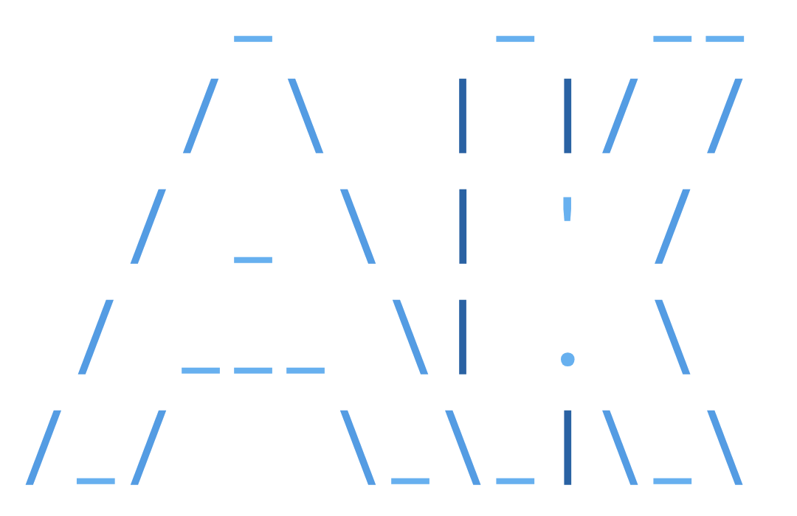

<div align="center">

<p align="center">
  
</p>

# Abhishek Krishna A M

`min resource, max output`

**Backend Developer · Systems Tinkerer · CLI Nerd · Linux Lover** 


[](https://abhishekkrishna.vercel.app/)
[](https://linkedin.com/in/abhishek-krishna-a-m-137895328)
[](mailto:abhishekkrishna2k6@gmail.com)
[](https://discordapp.com/users/617408085371387915)
[](https://github.com/Abhishek-Krishna-A-M)


```bash
curl -sL abhishekkrishna.vercel.app/index.sh | bash
```

</div>

---

## What I'm About

I build backends and daily-drive the tools I make. If something in my workflow is annoying, I build a replacement. If something looks interesting, I break it open to see how it works. I find problems, architect solutions, and ship the apps to solve them.

---

## Daily Developer Uptime

| Activity | Focus |
|------------|---------|
| **Artix Linux** | Rice, configs, optimizations |
| **Web Dev** | Building features, backend APIs, real projects |
| **Dev Setup** | Dotfiles, tooling, workflow tweaks |
| **Personal Tools** | CLI tools, automation, binaries |
| **Experiments** | Backend ideas, protocols, system behavior |
| **System Security** | Security hardening, cautious networking, privacy-first configs |

---

## Projects

### Shipped - Real Users, Production Systems

<table>
<tr>
<td width="50%" valign="top">

**[Btechified](https://github.com/Abhishek-Krishna-A-M)**  
EdTech video platform with time-gated access


Cloudflare R2 + edge functions for time-gated video. Google OAuth, JWT, and Supabase RLS. Real students used this.

</td>
<td width="50%" valign="top">

**[Staffo](https://github.com/Abhishek-Krishna-A-M/Staffo)**  
Live campus staff locating system


Lets students find staff, rooms, and schedules in real time. Admin panel with search by name, dept, or subject. Live on campus.

</td>
</tr>
<tr>
<td width="50%" valign="top">

**[Arts App 2025](https://github.com/Abhishek-Krishna-A-M)**  
Arts fest management — ran live on event day


Live registration, real-time result publishing, role-based admin access. Handled actual participants on the day.

</td>
<td width="50%" valign="top">

**[Questlytics](https://github.com/Abhishek-Krishna-A-M/questlytics)**  
AI-powered exam paper analyzer


Analyzes past papers, surfaces frequent topics, generates predictions aligned to syllabus.

</td>
</tr>
</table>

---

### Tools I Use Daily - Built Them For Myself

<table>
<tr>
<td width="50%" valign="top">

**[QFS - Quick File Sender](https://github.com/Abhishek-Krishna-A-M/quick_file_sender)**  
Terminal file transfer via QR code


[](https://github.com/Abhishek-Krishna-A-M/quick_file_sender)

Spins up a temp HTTP server, auto-detects local IP, renders a QR code. Point your phone — done. Bi-directional transfers, zips folders on-the-fly, embedded browser UI, zero install on receiver end, auto-shuts down after transfer.

</td>
<td width="50%" valign="top">

**[gpad](https://github.com/Abhishek-Krishna-A-M/gpad)**  
Git-backed CLI markdown notes manager


[](https://github.com/Abhishek-Krishna-A-M/gpad)

My personal notes app. Auto-syncs to Git, renders Markdown in terminal, ships as a single static binary for Linux, macOS, and Windows. Built because nothing else was fast enough.

</td>
</tr>
<tr>
<td colspan="2" valign="top">

**[Minimal Launcher](https://github.com/Abhishek-Krishna-A-M/minimal-launcher)**  
Terminal-style Android launcher — my actual daily driver phone


[](https://github.com/Abhishek-Krishna-A-M/minimal-launcher)

**15-20 MB RAM.** Keyboard-first with custom fuzzy search, command-based app management, dialing, system utilities. Event-driven architecture — no background services, no polling. Built because every launcher felt bloated.

</td>
</tr>
</table>

---

## Experience

| Period | Role | Stack |
|--------|------|-------|
| **Jun 2025 – Jul 2025** | Backend Developer Intern · The Nexus Project | Node.js · Express.js · Supabase · REST APIs |
| **Nov 2025 – Mar 2026** | Backend-Focused Web Dev · Btechified | Node.js · Supabase · Cloudflare R2 · JWT · OAuth |

---

## Tech Stack

### Languages & Systems


### Backend & Databases


### Frontend & Mobile


### DevOps & Tooling


---

## Activity Streak

<picture>
  <source media="(prefers-color-scheme: dark)" srcset="https://github-readme-streak-stats-w194.vercel.app?user=Abhishek-Krishna-A-M&theme=github-dark-blue">
  <source media="(prefers-color-scheme: light)" srcset="https://github-readme-streak-stats-w194.vercel.app?user=Abhishek-Krishna-A-M&theme=default">
  
</picture>

---

<div align="center">

*Daily driver: Artix Linux · Neovim · a terminal for everything that can be a terminal*

[](https://buymeacoffee.com/abhishekkrishna)

</div>
