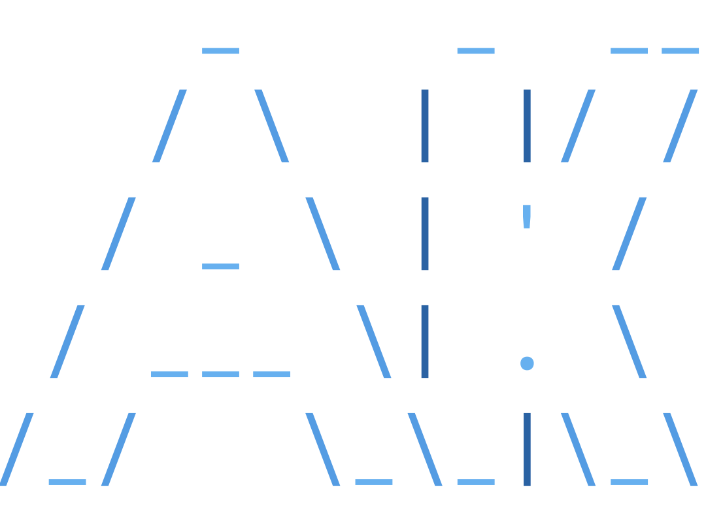

  

# Abhishek Krishna A M

`min resource, max output`

**Backend Developer · Systems Builder · Linux**

I build backends and daily-drive the tools I make. If something in my workflow is annoying, I build a replacement.

---

## Daily Uptime

| | |
|---|---|
| **OS** | Artix Linux — no systemd, no noise |
| **Editor** | Neovim — configured from scratch |
| **WM** | UWM — my own Wayland compositor |
| **Shell** | Bash + custom scripts for everything repetitive |
| **Backend** | APIs, auth systems, real-time features, storage pipelines |
| **Systems** | C, low-level tooling, protocol design |
| **Security** | Privacy-first configs, hardened networking |

---

## Projects

### Shipped — Real Users

<table>
<tr>
<td width="50%" valign="top">

**[Btechified](https://github.com/Abhishek-Krishna-A-M/Btechified)**
EdTech video platform — time-gated access, live students

Cloudflare R2 + edge functions for video delivery. Google OAuth, JWT, Supabase RLS.

</td>
<td width="50%" valign="top">

**[Staffo](https://github.com/Abhishek-Krishna-A-M/Staffo)**
Real-time campus staff locator — live on campus

Find staff by name, dept, or subject. Admin panel included.

</td>
</tr>
<tr>
<td width="50%" valign="top">

**[Arts App 2025](https://github.com/Abhishek-Krishna-A-M/arts_app_2025)**
Arts fest management — ran live on event day

Live registration, real-time results, role-based admin access.

</td>
<td width="50%" valign="top">

**[Questlytics](https://github.com/Abhishek-Krishna-A-M/questlytics)**
AI exam paper analyzer

Surfaces frequent topics from past papers, generates syllabus-aligned predictions.

</td>
</tr>
</table>

---

### Tools — Built and Use Daily

<table>
<tr>
<td width="50%" valign="top">

**[UWM](https://github.com/Abhishek-Krishna-A-M/UWM)**
BSP Wayland compositor

Built on wlroots. BSP, monocle, and floating layouts. Multi-monitor hotplug, unfocus dimming, per-window opacity, custom bar protocol (`zwp_uwm_bar_v1`).

</td>
<td width="50%" valign="top">

**[QFS](https://github.com/Abhishek-Krishna-A-M/quick_file_sender)**
Terminal file transfer via QR code

Spins a temp HTTP server, auto-detects local IP, renders QR. Bi-directional, zips folders, zero install on receiver.

</td>
</tr>
<tr>
<td width="50%" valign="top">

**[gpad](https://github.com/Abhishek-Krishna-A-M/gpad)**
Git-backed CLI markdown notes

Auto-syncs to Git, renders Markdown in terminal. Single static binary for Linux, macOS, Windows.

</td>
<td width="50%" valign="top">

**[Minimal Launcher](https://github.com/Abhishek-Krishna-A-M/minimal-launcher)**
Terminal-style Android launcher — my daily driver

**15–20 MB RAM.** Keyboard-first fuzzy search, event-driven — no background services, no polling.

</td>
</tr>
</table>

---

## Experience

| Period | Role | Stack |
|--------|------|-------|
| **May 2026 – Jun 2026** | Backend Developer Intern · Docwo · 🏆 Best Backend Developer | Node.js · Express · PostgreSQL · MinIO · Socket.io |
| **Nov 2025 – Mar 2026** | Backend Web Dev · Btechified — video pipeline, auth system, Cloudflare R2 | Node.js · Supabase · JWT · OAuth |
| **Jun 2025 – Jul 2025** | Backend Developer Intern · The Nexus Project | Node.js · Express.js · Supabase |

---
  
## Stack

### Languages & Systems

### Backend & Databases

### Frontend & Mobile

### DevOps & Tooling

---

<picture>
  <source media="(prefers-color-scheme: dark)" srcset="https://github-readme-streak-stats-w194.vercel.app?user=Abhishek-Krishna-A-M&theme=github-dark-blue">
  <source media="(prefers-color-scheme: light)" srcset="https://github-readme-streak-stats-w194.vercel.app?user=Abhishek-Krishna-A-M&theme=meta-light">
  
</picture>

---

*Artix Linux · Neovim · a terminal for everything that can be a terminal*

